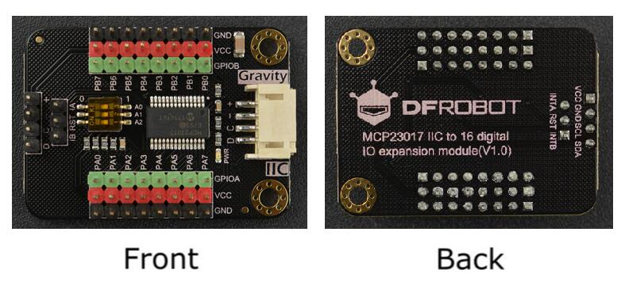

# DFRobot_MCP23017

* [中文](./README_CN.md)

This is a 16-bit digital IO expansion board that communicates with main-controller via IIC to read and set Level value of the pins. <br>
The board supports 8 IIC addresses. One main-controller board can be connected with at most 8 modules in parallel to expand 128 IO ports. <br>

* Project URL : ```https://github.com/DFRobot/DFRobot_MCP23017```

* Tutorial URL : [Wiki](http://wiki.dfrobot.com.cn/index.php?title=(SKU:DFR0626)MCP23017_IIC_to_16_digital_IO_expansion_module).

* Get a purchase connection: [store](https://www.dfrobot.com/).



## Product Link（[https://www.dfrobot.com/product-2002.html](https://www.dfrobot.com/product-2002.html)）
    SKU: DFR0626


## Table of Contents

* [Summary](#summary)
* [Installation](#installation)
* [Methods](#methods)
* [Compatibility](#compatibility)
* [History](#history)
* [Credits](#credits)

## Summary

1. Set pin mode: input, output, pull-up input(internal 100KΩ pull-up resistor); <br>
2. Read and set pin Level value; <br>
3. Support 5 interruption modes: high-level interrupt, low-level interrupt, rising edge interrupt, falling edge interrupt, double edge interrupts; <br>
4. Support 2-way interrupt signal output: when an interrupt occurs on a pin of portA, pin INTA output High level, when an interrupt on a pin of PortB, INTB output High level; <br>
5. Polled interrupt: detect if an interrupt occurs on the pins via polled interrupt function, and run the relevant interrupt service function; <br>

## Installation

To use this library, first download the library file, paste it into the \Arduino\libraries directory, then open the examples folder and run the demo in the folder.

## Methods

```C++
  /**
   * @fn DFRobot_MCP23017
   * @brief Constructor
   * @param wire I2C bus pointer object. When calling the function, you may transfer a parameter into it. Defaule as Wire
   * @param addr 8 bits I2C address, range 0x20~0x27. Change A2A1A0 via DIP switch to revise IIC address. When calling the function, 
   * @n the I2C address can be designated. (default: 0x27)
   * @n 0  0  1  0  | 0  A2 A1 A0
   * @n 0  0  1  0  | 0  1  1  1    0x27
   * @n 0  0  1  0  | 0  1  1  0    0x26
   * @n 0  0  1  0  | 0  1  0  1    0x25
   * @n 0  0  1  0  | 0  1  0  0    0x24
   * @n 0  0  1  0  | 0  0  1  1    0x23
   * @n 0  0  1  0  | 0  0  1  0    0x22
   * @n 0  0  1  0  | 0  0  0  1    0x21
   * @n 0  0  1  0  | 0  0  0  0    0x20
   */
  DFRobot_MCP23017(TwoWire &wire = Wire, uint8_t addr = 0x27);

  /**
   * @fn begin
   * @brief Init function
   * @return Return 0 if initialization succeeds, otherwise return non-zero. 
   */
  int begin(void);
  
  /**
   * @fn pinMode
   * @brief Set the pin mode to  input, output or pull-up input (internal 100KΩ pull-up resistor)
   * @param pin Pin number, it could be all enumeration values (eGPA0-eGPB7/ 0-15) included in ePin_t. 
   * @param mode Mode, it can be set to Input, Output, Pull-up Input (internal 100KΩ pull-up resistor)
   * @return Return 0 if the setting is successful, otherwise return non-zero. 
   */
  int pinMode(ePin_t pin, uint8_t mode);
  
  /**
   * @fn digitalWrite
   * @brief Write digtial pin. The pin needs to be set to output mode before writing. 
   * @param pin Pin number, it could be all enumeration values (eGPA0-eGPB7/ 0-15) inlcuded in ePin_t.
   * @param level High level 1 or Low level 0
   * @return Return 0 if the writing is successful, otherwise return non-zero. 
   */
  int digitalWrite(ePin_t pin, uint8_t level);
  
  /**
   * @fn digitalRead
   * @brief Read digital pin. The pin needs to be set to input mode before reading. 
   * @param pin Pin number, it could be all enumeration values (eGPA0-eGPB7/ 0-15) included in ePin_t.
   * @return Return High or Low
   */
  int digitalRead(ePin_t pin);
  
  /**
   * @fn pinModeInterrupt
   * @brief Set a pin to interrupt mode 
   * @param pin Pin number, it could be all enumeration values (eGPA0-eGPB7/ 0-15) included in ePin_t.
   * @param mode Interrupt mode: all enumeration values included in eInterruptMode_t.
   * @param cb Interrupt service function, needs to be defined and transferred parameter by users. 
   * @n Prototype: void func(int)
   */
  void pinModeInterrupt(ePin_t pin, eInterruptMode_t mode,  MCP23017_INT_CB cb);
  
  /**
   * @fn pollInterrupts
   * @brief Poll if an interrupt occurs on a port group. 
   * @param group Port group, it could be all enumeration values included in eGPIOGrout_t, 
   * @n GPIO Group A(eGPIOA), GPIO Group B(eGPIOB) Group A+B (eGPIOALL).
   * @n When setting to eGPIOA，poll if an interrupt occurs on the port group A. 
   * @n When setting to eGPIOB, poll if an interrupt occurs on the port group B. 
   * @n When setting to eGPIOALL, poll if an interrupt occurs on the port group A+B
   * @n None, poll if an interrupt occurs on the all ports of group A and B by default. 
   */
  void pollInterrupts(eGPIOGrout_t group=eGPIOALL);
  
  /**
   * @fn pinDescription
   * @brief Convert pin into string description 
   * @param pin Pin number, it could be all enumeration values (eGPA0-eGPB7/ 0-15) inlcuded in ePin_t.
   * @return Return pin description string 
   * @n   such as "eGPA0" "eGPA1" "eGPA2" "eGPA3" "eGPA4" "eGPA5" "eGPA6" "eGPA7"
   * @n   "eGPB0" "eGPB1" "eGPB2" "eGPB3" "eGPB4" "eGPB5" "eGPB6" "eGPB7"
   * @n   "eGPA" "eGPB"
   */
  String pinDescription(ePin_t pin);
  
  /**
   * @fn pinDescription
   * @brief Convert pin into string description 
   * @param pin Pin number, range 0~15
   * @return Return pin description string
   * @n such as "eGPA0" "eGPA1" "eGPA2" "eGPA3" "eGPA4" "eGPA5" "eGPA6" "eGPA7"
   * @n   "eGPB0" "eGPB1" "eGPB2" "eGPB3" "eGPB4" "eGPB5" "eGPB6" "eGPB7"
   * @n   "eGPA" "eGPB"
   */
  String pinDescription(int pin);
```

## Compatibility

MCU                | Work Well    | Work Wrong   | Untested    | Remarks
------------------ | :----------: | :----------: | :---------: | -----
Arduino Uno        |      √       |              |             | 
Mega2560        |      √       |              |             | 
Leonardo        |      √       |              |             | 
ESP32         |      √       |              |             | 
micro:bit        |      √       |              |             | 

## History

- 2019/07/18 - Version 1.0.0 released.
- 2025/06/03 - Version 1.0.1 released.

## Credits

Written by Arya(xue.peng@dfrobot.com), 2019. (Welcome to our [website](https://www.dfrobot.com/))


