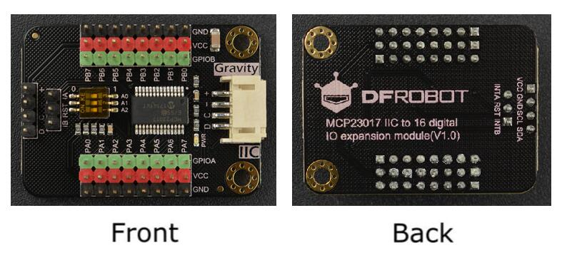

DFRobot_MCP23017
===========================

* [English Version](./README.md)

这是一款16位数字IO口扩展板，通过IIC接口与主控通信，可以读取并设置引脚的电平值。<br>
支持8个IIC地址，一块主控上最多并联8个模块，一次最多扩展128个IO口。<br>




## 产品链接（[https://www.dfrobot.com.cn/goods-2657.html](https://www.dfrobot.com.cn/goods-2657.html)）
    SKU: DFR0626   
   
## 目录

* [概述](#概述)
* [库安装](#库安装)
* [方法](#方法)
* [兼容性](#兼容性)
* [历史](#历史)
* [创作者](#创作者)

## 概述

1. 设置引脚模式：输入模式、输出模式、上拉输入模式(内部上拉电阻100KΩ)；<br>
2. 读取并设置引脚电平值；<br>
3. 支持5种中断方式：高电平中断、低电平中断、上升沿中断、下降沿中断、双边沿跳变中断；<br>
4. 支持2路中断信号输出：当端口A的某个引脚发生中断时，INTA引脚输出高电平，当端口B的某个引脚发生中断，INTB引脚输出高电平；<br>
5. 轮询中断：可通过轮询中断函数，检测引脚是否发生中断，并执行相应的中断服务函数；<br>

## 库安装

使用此库前，请首先下载库文件，将其粘贴到\Arduino\libraries目录中，然后打开examples文件夹并在该文件夹中运行演示。

## 方法

```C++
  /**
   * @fn DFRobot_MCP23017
   * @brief 构造函数
   * @param wire I2C总线指针对象，构造设备，可传参数也可不传参数，默认Wire
   * @param addr 8位I2C地址，范围0x20~0x27,可通过拨码开关更改A2A1A0来更改地址，构造设备时，可以指定它的I2C地址，默认0x27
   * @n 0  0  1  0  | 0  A2 A1 A0
   * @n 0  0  1  0  | 0  1  1  1    0x27
   * @n 0  0  1  0  | 0  1  1  0    0x26
   * @n 0  0  1  0  | 0  1  0  1    0x25
   * @n 0  0  1  0  | 0  1  0  0    0x24
   * @n 0  0  1  0  | 0  0  1  1    0x23
   * @n 0  0  1  0  | 0  0  1  0    0x22
   * @n 0  0  1  0  | 0  0  0  1    0x21
   * @n 0  0  1  0  | 0  0  0  0    0x20
   */
  DFRobot_MCP23017(TwoWire &wire = Wire, uint8_t addr = 0x27);

  /**
   * @fn begin
   * @brief 初始化函数
   * @return 返回0表示初始化成功，返回其他值表示初始化失败
   */
  int begin(void);
  
  /**
   * @fn pinMode
   * @brief 设置引脚模式，将其配置为输入、输出或上拉输入模式(内部上拉电阻100KΩ)
   * @param pin 引脚编号，可填ePin_t包含的所有枚举值（eGPA0-eGPB7/ 0-15）
   * @param mode 模式，可设置输入(INPUT)、输出(OUTPUT)、上拉输入(INPUT_PULLUP)模式(内部上拉电阻100KΩ)
   * @return 返回0表示设置成功，返回其他值表示设置失败
   */
  int pinMode(ePin_t pin, uint8_t mode);
  
  /**
   * @fn digitalWrite
   * @brief 写数字引脚，在写引脚之前，需要将引脚设置为输出模式
   * @param pin 引脚编号，可填ePin_t包含的所有枚举值（eGPA0-eGPB7/ 0-15）
   * @param level 高低电平 1(HIGH)或0(LOW)
   * @return 返回0表示设置成功，返回其他值表示写入失败
   */
  int digitalWrite(ePin_t pin, uint8_t level);
  
  /**
   * @fn digitalRead
   * @brief 读数字引脚，在读引脚之前，需要将引脚设置为输入模式
   * @param pin 引脚编号，可填ePin_t包含的所有枚举值（eGPA0-eGPB7/ 0-15）
   * @return 返回高低电平
   */
  int digitalRead(ePin_t pin);
  
  /**
   * @fn pinModeInterrupt
   * @brief 将某个引脚设置为中断模式
   * @param pin 引脚编号，可填ePin_t包含的所有枚举值（eGPA0-eGPB7/ 0-15）
   * @param mode 中断方式：可填eInterruptMode_t包含的所有枚举值
   * @param cb 中断服务函数，由用户外部定义函数传参，原型为void func(int)
   */
  void pinModeInterrupt(ePin_t pin, eInterruptMode_t mode,  MCP23017_INT_CB cb);
  
  /**
   * @fn pollInterrupts
   * @brief 轮询某组端口是否发生中断
   * @param group 端口组，可填eGPIOGrout_t包含的所有枚举值GPIO A组（eGPIOA）、GPIO B组（eGPIOB）A+B组（eGPIOALL）
   * @n 填eGPIOA，则轮询A组端口是否发生中断
   * @n 填eGPIOB，则轮询B组端口是否发生中断
   * @n 填eGPIOALL，则轮询A组和B组端口是否发生中断
   * @n 不填，默认轮询A组和B组所有端口是否发生中断
   */
  void pollInterrupts(eGPIOGrout_t group=eGPIOALL);
  
  /**
   * @fn pinDescription
   * @brief 将引脚转为字符串描述
   * @param pin 引脚编号，可填ePin_t包含的所有枚举值（eGPA0-eGPB7/ 0-15）
   * @return 返回引脚描述字符串
   * @n 如"GPIOA0" "GPIOA1" "GPIOA2" "GPIOA3" "GPIOA4" "GPIOA5" "GPIOA6" "GPIOA7"
   * @n   "GPIOB0" "GPIOB1" "GPIOB2" "GPIOB3" "GPIOB4" "GPIOB5" "GPIOB6" "GPIOB7"
   */
  String pinDescription(ePin_t pin);
  
  /**
   * @fn pinDescription
   * @brief 将引脚转为字符串描述
   * @param pin 引脚编号，范围0~15
   * @return 返回引脚描述字符串,
   * @n 如"GPIOA0" "GPIOA1" "GPIOA2" "GPIOA3" "GPIOA4" "GPIOA5" "GPIOA6" "GPIOA7"
   * @n   "GPIOB0" "GPIOB1" "GPIOB2" "GPIOB3" "GPIOB4" "GPIOB5" "GPIOB6" "GPIOB7"
   */
  String pinDescription(int pin);
```

## 兼容性

MCU                | Work Well    | Work Wrong   | Untested    | Remarks
------------------ | :----------: | :----------: | :---------: | -----
Arduino Uno        |      √       |              |             | 
Mega2560        |      √       |              |             | 
Leonardo        |      √       |              |             | 
ESP32         |      √       |              |             | 
micro:bit        |      √       |              |             | 

## 历史

- 2019/07/18 - 1.0.0 版本
- 2025/06/03 - 1.0.1 版本

## 创作者

Written by Arya(xue.peng@dfrobot.com), 2021. (Welcome to our [website](https://www.dfrobot.com/))


